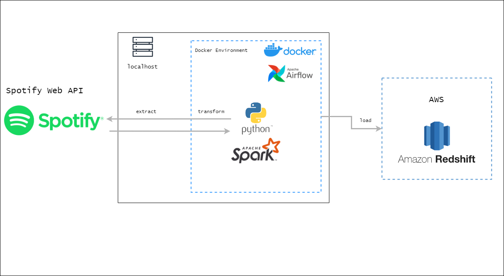

# ETL-Spotify 

Repositorio para el proyecto final del curso de Data Engineering en [CODERHOUSE](https://www.coderhouse.com/).



En este proyecto, llevaremos a cabo un proceso ETL (Extract, Transform, Load) utilizando datos extraídos de la WEB API de [Spotify](https://developer.spotify.com/documentation/web-api/tutorials/getting-started) y cargándolos en AWS Redshift. Todo el proceso estará automatizado mediante el uso de Apache Airflow.

El ETL extrae información del catálogo de Spotify sobre las mejores canciones de un artista por país.

## Pasos
1. Registrarse en la API de [Spotify](https://developer.spotify.com/documentation/web-api/tutorials/getting-started). Con esto obtendremos los siguientes datos:
    - CLIENT_ID
    - CLIENT_SECRECT
2. Crear las siguientes carpetas a la misma altura del `docker-compose.yml`.
```bash
mkdir logs
mkdir plugins
mkdir postgres_data
```
3. Crear un archivo con variables de entorno llamado `.env` ubicado a la misma altura que el `docker-compose.yml`. Cuyo contenido sea:
```bash
REDSHIFT_HOST=... # YOUR_REDSHIFT_HOST
REDSHIFT_PORT=... # YOUR_REDSHIFT_PORT
REDSHIFT_DB=... # YOUR_REDSHIFT_DB
REDSHIFT_USER=... # YOUR_REDSHIFT_USER
REDSHIFT_SCHEMA=... # YOUR_REDSHIFT_SCHEMA
REDSHIFT_PASSWORD=... # YOUR_REDSHIFT_PASSWORD
REDSHIFT_URL="jdbc:postgresql://${REDSHIFT_HOST}:${REDSHIFT_PORT}/${REDSHIFT_DB}?user=${REDSHIFT_USER}&password=${REDSHIFT_PASSWORD}"
DRIVER_PATH=/tmp/drivers/postgresql-42.5.2.jar
SPOTIFY_CLIENT_ID="AAAAaaaaBBBBbbbb" # YOUR_CLIENT_ID
SPOTIFY_CLIENT_SECRET="123abc" # YOUR_CLIENT_SECRET
```
4. Descargar las imagenes de Airflow y Spark.
```bash
docker pull lucastrubiano/airflow:airflow_2_6_2
docker pull lucastrubiano/spark:spark_3_4_1
```
5. Las imagenes fueron generadas a partir de los Dockerfiles ubicados en `docker_images/`. Si se desea generar las imagenes nuevamente, ejecutar los comandos que están en los Dockerfiles.
6. Ejecutar el siguiente comando para levantar los servicios de Airflow y Spark.
```bash
docker-compose up --build
```
7. Una vez que los servicios estén levantados, ingresar a Airflow en `http://localhost:8080/`.
8. En la pestaña `Admin -> Connections` crear una nueva conexión con los siguientes datos para Redshift:
    * Conn Id: `redshift_default`
    * Conn Type: `Amazon Redshift`
    * Host: `host de redshift`
    * Database: `base de datos de redshift`
    * Schema: `esquema de redshift`
    * User: `usuario de redshift`
    * Password: `contraseña de redshift`
    * Port: `5439`
9. En la pestaña `Admin -> Connections` crear una nueva conexión con los siguientes datos para Spark:
    * Conn Id: `spark_default`
    * Conn Type: `Spark`
    * Host: `spark://spark`
    * Port: `7077`
    * Extra: `{"queue": "default"}`
10. En la pestaña `Admin -> Variables` crear una nueva variable con los siguientes datos:
    * Key: `driver_class_path`
    * Value: `/tmp/drivers/postgresql-42.5.2.jar`
11. En la pestaña `Admin -> Variables` crear una nueva variable con los siguientes datos:
    * Key: `spark_scripts_dir`
    * Value: `/opt/airflow/scripts`
12. Ejecutar el DAG `etl_spotify`.
